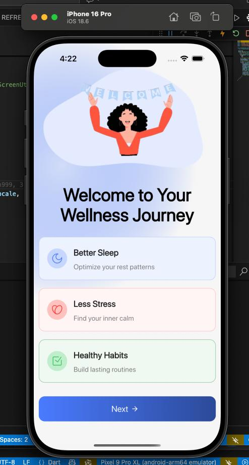
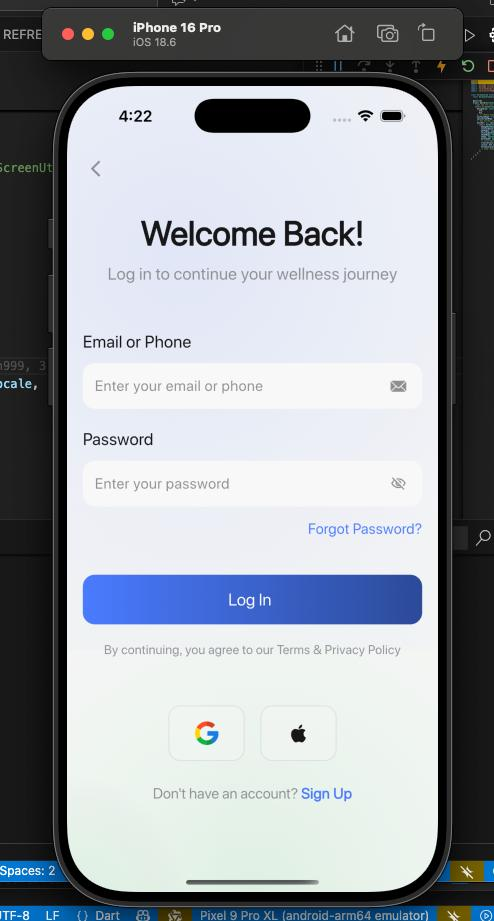
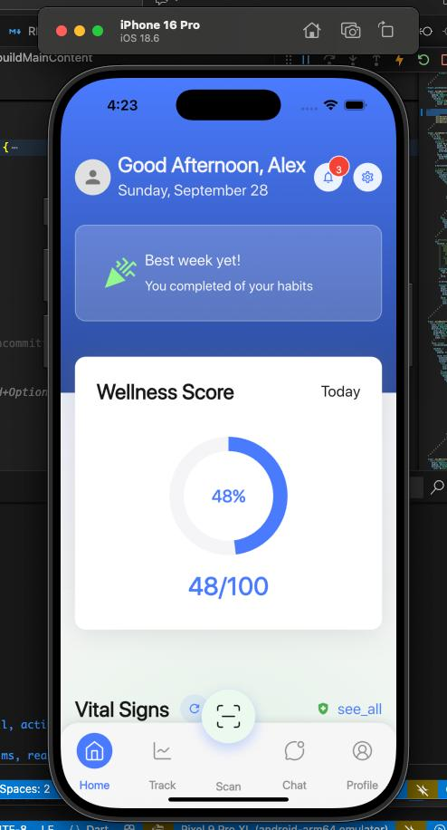
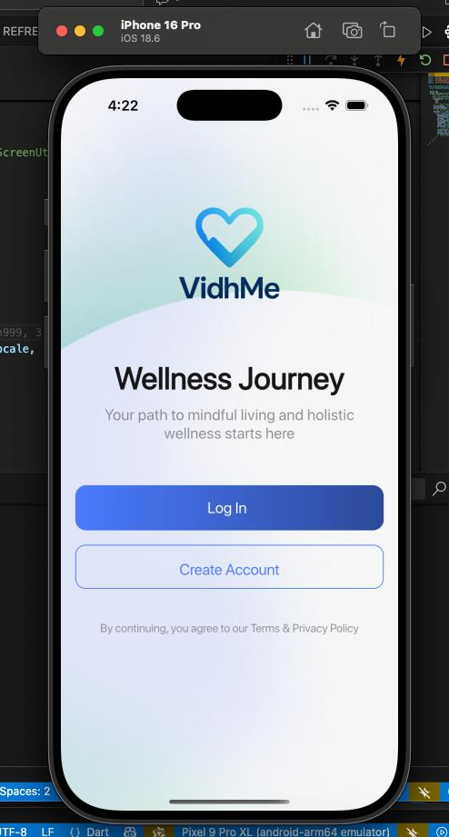
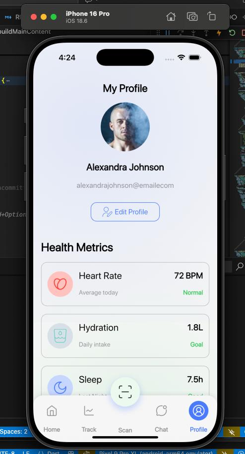
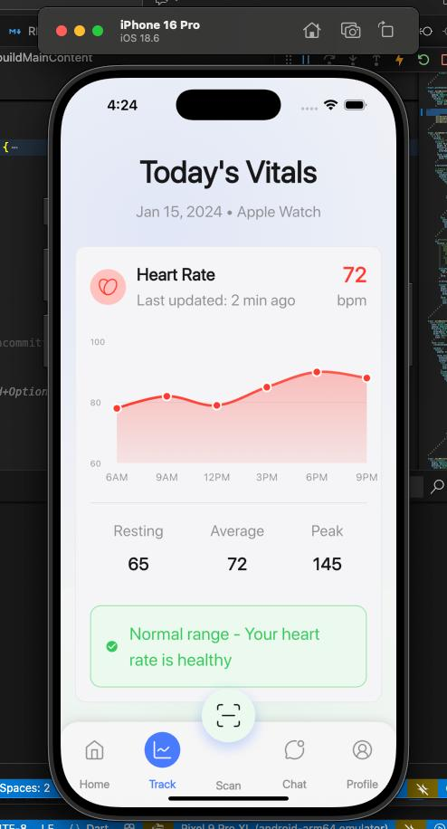

# Apple Watch Health Monitoring App

A Flutter app that monitors and visualizes health data from wearables. The project follows a clean, modular architecture with GetX for state management, reusable UI components, and responsive design utilities.

## Project structure

### Core Application (`lib/`)
- **`app.dart`** - Main app configuration and initialization
- **`main.dart`** - Application entry point and Flutter app setup
- **`core/`** - Shared foundation layer
  - `common/` - Reusable UI components and global styles
    - `widgets/` - Custom buttons, text fields, backgrounds
    - `styles/` - Global text styling system with ScreenUtil
  - `utils/constants/` - App-wide constants (colors, dimensions)
  - `localization/` - Multi-language support system (11 languages)
    - `languages/` - Translation files (en, hi, ur, bn, fr, de, ar, ml, te, ta, pa)
  - `models/` - Shared data models and entities
- **`features/`** - Feature-based modules (clean architecture)
  - `authentication/` - Login, signup, password recovery flows
    - `controllers/` - GetX state management controllers
    - `presentation/screens/` - UI screens and forms
  - `splash_screen/` - App startup and initialization
  - `home/` - Dashboard with health data integration
  - `profile/` - User profile and settings management
- **`routes/`** - Navigation and routing configuration

### Assets & Resources (`assets/`)
- **`animations/`** - Onboarding GIFs and welcome animations
- **`app_screenshots/`** - Demo screenshots (auth, home, profile, watch_data)
- **`fonts/SFProDisplay/`** - Custom typography system
- **`icons/`** - SVG and PNG icons for UI elements
- **`images/`** - App images and visual resources

### Platform Implementations
- **`android/`** - Android-specific configurations and build files
- **`ios/`** - iOS configurations, HealthKit capabilities, Info.plist
- **`macos/`**, **`windows/`**, **`linux/`** - Desktop platform support
- **`web/`** - Web platform configuration and manifest

### Documentation & Configuration
- **`ARCHITECTURE.md`** - Detailed architecture guide and coding patterns
- **`Health Data.md`** - Apple Watch integration implementation
- **`HEALTH_INTEGRATION_IMPLEMENTATION.md`** - Real-time health data flow
- **`LOCALIZATION_GUIDE.md`** - Multi-language system documentation
- **`pubspec.yaml`** - Dependencies and project configuration
- **`analysis_options.yaml`** - Code quality and linting rules

## Key Features

### 🏥 Apple Watch Health Integration
Real-time health data synchronization from Apple Watch via iOS Health app integration:

**Data Flow**: `Apple Watch → iOS Health App → Flutter App → UI Display`

**Supported Metrics**:
- **Steps**: Daily step count with real-time updates
- **Heart Rate**: Latest BPM readings from Apple Watch  
- **Active Calories**: Burned calories with precise decimal formatting
- **Sleep Data**: Total sleep hours from all sleep stages
- **Additional**: Distance, flights climbed, workouts, blood oxygen, body temperature

**Implementation Highlights**:
- Pull-to-refresh health data synchronization
- iOS HealthKit permissions management
- Real-time reactive UI updates via GetX
- Backend integration ready with formatted API payload
- Error handling and offline data fallbacks

For complete implementation details, see `Health Data.md` and `HEALTH_INTEGRATION_IMPLEMENTATION.md`.

### 🌍 Multi-Language Support (11 Languages)
Comprehensive localization system supporting:

**Supported Languages**: English, Hindi, Urdu, Bangla, French, German, Arabic, Malayalam, Telugu, Tamil, Punjabi

**Features**:
- Instant language switching with reactive UI updates
- Local storage persistence across app sessions  
- Professional translation keys for all authentication flows
- Seamless GetX integration with `.tr` extensions
- Language selection UI in signup and settings screens

For localization implementation guide, see `LOCALIZATION_GUIDE.md`.

## App screenshots

Below are small previews from `assets/app_screenshots` (sized for a compact README):

<p>
  
  
</p>
<p>
  
  
</p>
<p>
  
  
</p>

> Note: HTML  tags are used above for reliable sizing across renderers like GitHub. If your markdown renderer ignores HTML, the images will still display at their native size.

## Run the project (Windows / Flutter)

Prerequisites:
- Flutter SDK installed (your VS Code settings point to a local SDK path)
- Android SDK or a connected device / emulator (for mobile targets)

Quick steps:

1. From the project root, fetch packages:

```powershell
flutter pub get
```

2. To run on Windows desktop (if enabled):

```powershell
flutter run -d windows
```

3. To run on an Android device or emulator:

```powershell
flutter run -d <device-id>
```

If you use VS Code, open the folder, pick a device from the status bar, then press F5 or use the Run and Debug pane.

## More details

For architecture and implementation patterns, see `ARCHITECTURE.md` and other docs in the repo.
